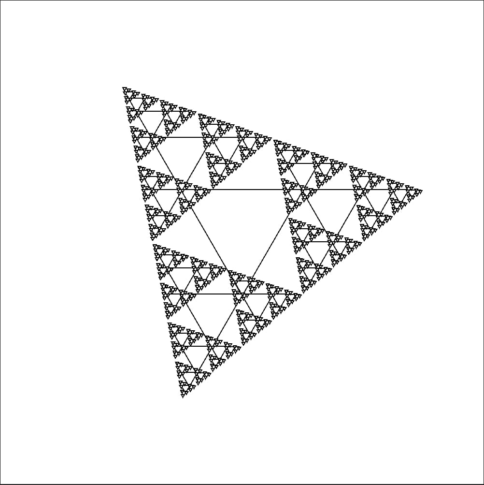

# Sierpinski Triangle

This is one of my projects that I am most proud of. Not only was it hard to create one recursively, but to also use SFML to draw
the triangle to the screen. One method of drawing triangles was to either draw the vertices and then connect them, or create a convex shape based of X, and Y positions to create multiple points that would be the vertices. I created a simple triangle function that would take in a X, a Y, and side length.


## Optimizations


One feature I implemented was instead of drawing X amount of triangles to the screen
    constantly. I instead made a render texture from the drawings and then making a sprite
    of the screen size and setting the texture of the sprite to the render texture 
    that way im only refreshing a texture and not the hundreds or thousands of triangles. It
    was more of an optimization feature.

## Installation

Step 1: Need Linux or WSL(For Windows), to run the project. You will also need XLaunch, and SFML to draw to the screen.

Step 2: Launch terminal, or WSL in Powershell or CMD for Windows Machines.  
Then launch:   
XLaunch -> Multiple Windows -> Start No Client -> Disable Access Control -> Finish


## Terminal Commands:

Compile:
```bash
make
```
Run: 
```bash
./TFractal (Length) (Depth)
```
Example:
```bash
./TFractal 250 6
```
## Screenshots



